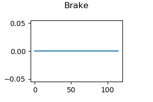
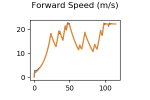
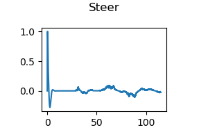
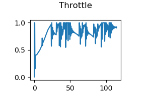
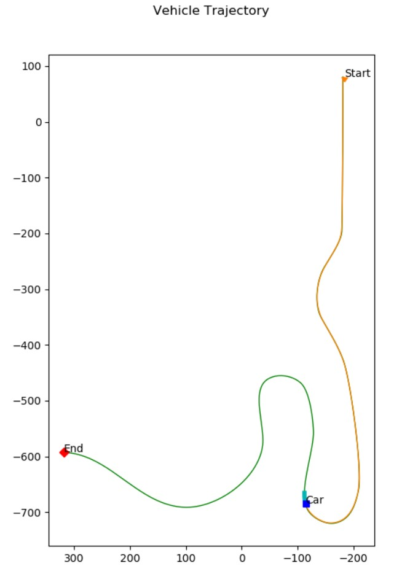
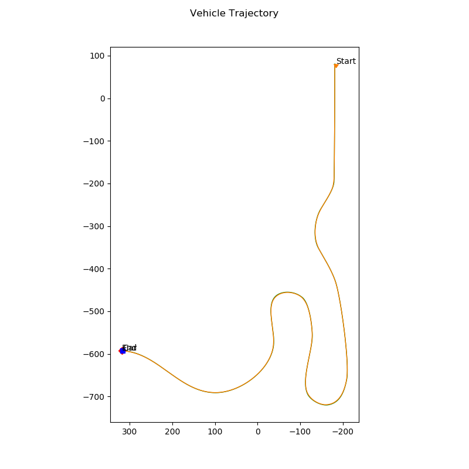

# 2D Controller project for autonomous car

In this project, i wrote and implemented a controller for the CARLA simulator.
my goal was to control the vehicle to follow a race track by navigating through preset waypoints.
The vehicle needs to reach these waypoints at certain desired speeds,
so both longitudinal and lateral control will be required.

the project is a part of self driving car coursre which providing to me python script(a.k.a module_7.py)
to handle the communication between my controller and carla simulator ,
getting feedback from carla and game time sending it to the controller
and then send back controller's outputs to carla to adjust car speed and steering
  
## Project Objectives

- Integrate vehicle modeling and controller design into a complete vehicle control system
- Develop a working simulation with a python-based vehicle autonomy agent
- Tune a control system for tracking performance on a complex path

## Implementation approach

The Control process consist of two parts longitudinal and lateral Control.

- ### Firstly the longitudinal controller

  - Implementation Brief

        I have chosen to Implement closed-loop PID controller to control
        the speed of the vehicle to achieve desired velocity which will be the set point
        and the actuall velocity will be our feedback .

        The controller gains (propotional , differntial and integral)
        were tuned (by trial and error process) till i could get
        satisfying results for my controller

        The controller output will represent the acceleration required depending on
        current and desired speeds
        and if the Acc was positive then we need increase Throttle precentage
        and if the Acc was negative then we need increase Brake precentage

  - Controller inputs
    - Desired velocity
  - Controller outputs
    - Throttle precentage [0 to 1 in percentage]
    - Brake precentage  [0 to 1 in percentage]

- ### Secondly the lateral controller

  - Implementation Brief

        I have chosen to Implement stanely controller to control
        the steering angle of the vehicle to achieve desired location and yaw  will be the set point
        and steering angle .

        The controller gains (softeness and propotional)
        were chosen by trial and error process till i could get
        satisfying results for my controller

  - Controller inputs
    - Current X position (meters)
    - Current Y position (meters)
    - Current yaw pose (radians)
    - Current waypoints to track
  - Controller outputs
    - Steering angle [-1.22 to 1.22 in radians, from left to right]

## Running and Testing the controller

The simulator will begin to run if the module_7 client connects to carla server properly.
It will open two new feedback windows one of which shows the trajectory and the other which shows the controls feedback.

The trajectory feedback will contain the car,
start and end positions,entire path/path traveled and a small shaded region
which denotes the subset of interpolated points to be sent into the controller for control updates.
Linear interpolation is used between waypoints to provide a finer resolution path/speed requests for the controller.
The X and Y axes are in meters.

The controls feedback shows the throttle, steering and brake outputs,
as well as the speed response for the simulation (desired speed and current speed in the single plot).
This is a general feedback for viewing what the client is sending to the CARLA server in terms of control commands.
The desired speed is set to the closest interpolated speed point to the current position of the car.
The speeds are in meters per second and the throttle (0 to 1), brake (0 to 1)
and steering (-1 to 1, or left to right turn) are unitless.
Note that the steering command output inside controller2d.py
is automatically converted from radians (-1.22 to 1.22 rad)
to a percentage (-1 to 1) before the command is sent to the CARLA server.
The X axis for all four plots in the controls feedback is the in-game time, in seconds.

## Output Screenshots

Brake Output            |  Forward Speed
:-------------------------:|:-------------------------:
 |   
 *The speed kept so less than or equal to the desired spped so there was no need for brakes.* | *The desired speed in yellow & controller's speed results in blue.*

Steering Output             |  Throttle Output
:-------------------------:|:-------------------------:
   |  

In progress             |  At the finish line
:-------------------------:|:-------------------------:
 *The image shows the controller operation in progress.* |   *The image shows the controller operation after completion.*

## The Controller In Action

 

